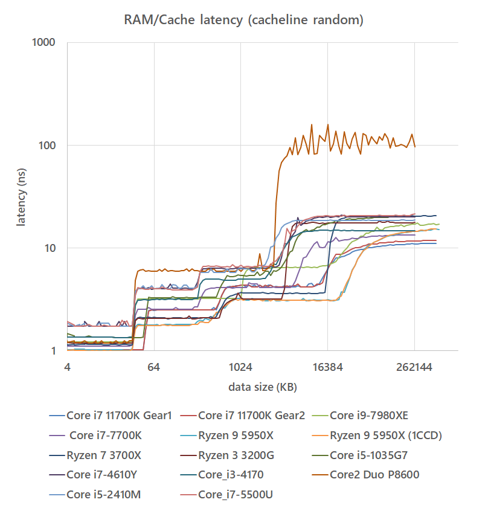

# ram_speed
by rigaya

This is an attempt to measure RAM and cache performace.

It will run performace tests below.
- intercore latency tests
- RAM/Cache latency tests
- RAM/Cache bandwidth tests 

Please note that this app is sensitive to background tasks, and might not get expected results.

## System Requirements
Windows 8.1/10 (x64)  
Linux (x64)  

## Results
### Tested Systems
| CPU                   | Cores   |  RAM              | RAM Timing    |
|:---                   |:---     |:---              |:---           |
| i9 7980XE @ 4.0GHz    | 18C/36T | DDR4-3600 4ch    | 17-19-19-41-1 |
| i7 7700K              | 4C/8T   | DDR4-3600 2ch    | 18-22-22-42-2 |
| Ryzen7 3700X          | 8C/16T  | DDR4-3600 2ch    | 18-22-22-43-1 |
| Ryzen7 1700X          | 8C/16T  | DDR4-2666 2ch    | 16-16-16-38-1 | 
| Ryzen3 3200G @ 4.2GHz | 4C/4T   | DDR4-2666 2ch    | 16-18-18-40-1 |
| i5 1035G7             | 4C/8T   | LPDDR4X-3733 2ch | 20-20-20-45-? |
| i7 4610Y              | 2C/4T   | DDR3-1600 2ch    | 11-11-11-28-1 |
| i3 4170               | 2C/4T   | DDR3-2133 2ch    |  9-11-10-28-2 |
| i5 5500U              | 2C/4T   | DDR3-1600 2ch    | 11-11-11-28-1 |
| i5 2410M              | 2C/4T   | DDR3-1333 2ch    |  9-9-9-24-1   |
| Core2Duo P8600        | 2C/2T   | DDR2-800 2ch     |  6-6-6-18-?   |

### RAM/Cache bandwidth MT
Result of the bandwidth test, using all physical cores on the CPU.  
 

### RAM/Cache bandwidth ST
Result of the bandwidth test, using a single cores on the CPU.  
 

### RAM bandwidth
Result of the bandwidth test, checking the bandwidth of the largest size tested.  
 

### RAM/Cache latency cachline random
 

### RAM/Cache latency full random

## To Build
### Windows
VC++2019 & nasm is required.

### Linux
C++14 compiler is required, and also nasm is recommended.  

However, it is possible to build without nasm, by changing ENABLE_ASM to 0 in makefile. In that case, using clang is recommended. 

## Precautions for using ram_speed
THE SOFTWARE IS PROVIDED "AS IS", WITHOUT WARRANTY OF ANY KIND.  

## License
The MIT License will be applied. 