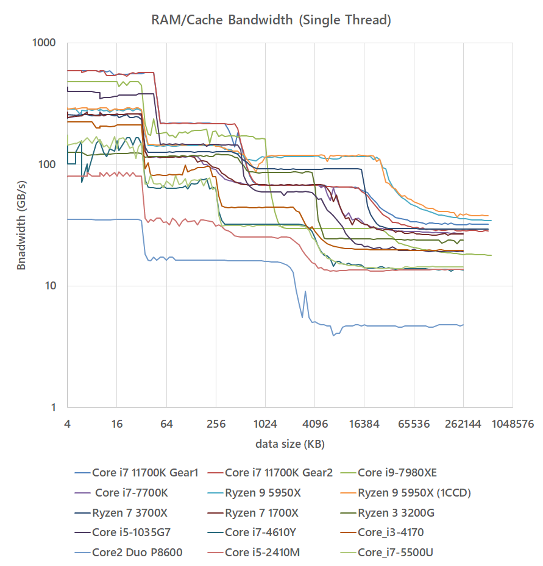

# ram_speed
by rigaya

This is an attempt to measure RAM and cache performace.

It will run performace tests below.
- intercore latency tests
- RAM/Cache latency tests
- RAM/Cache bandwidth tests 

Please note that this app is sensitive to background tasks, and might not get expected results.

## System Requirements
Windows 8.1/10 (x64)  
Linux (x64)  

## Results
### RAM/Cache bandwidth MT
Result of the bandwidth test, using all physical cores on the CPU.
 

### RAM/Cache bandwidth ST
Result of the bandwidth test, using a single cores on the CPU.
 

### RAM bandwidth
Result of the bandwidth test, checking the bandwidth of the largest size tested.
 

### RAM/Cache latency cachline random
 

### RAM/Cache latency full random

## To Build
### Windows
VC++2019 & nasm is required.

### Linux
C++14 compiler is required, and also nasm is recommended.  

However, it is possible to build without nasm, by changing ENABLE_ASM to 0 in makefile. In that case, using clang is recommended. 

## Precautions for using ram_speed
THE SOFTWARE IS PROVIDED "AS IS", WITHOUT WARRANTY OF ANY KIND.  

## License
The MIT License will be applied. 